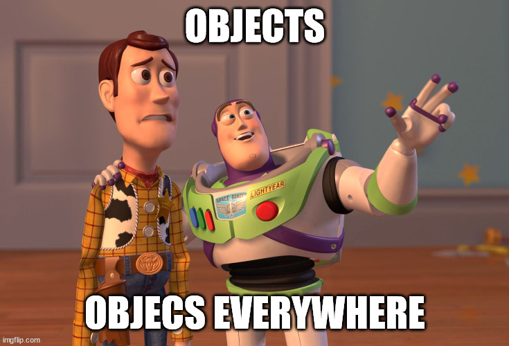
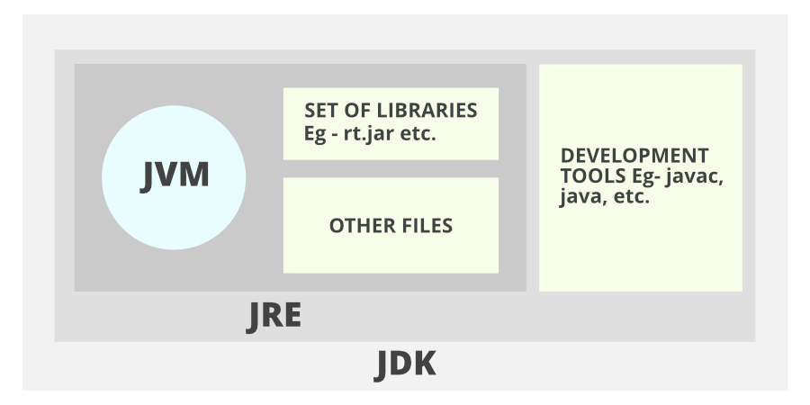

# Java è il miglior ecosistema sul quale fare software a oggi

*Descrivimi, con una frase, java come linguaggio di programmazione:* 

Gemini: 

> Java è un linguaggio di programmazione **orientato agli oggetti**, **indipendente dalla piattaforma** (grazie alla JVM)
e **largamente utilizzato** per lo sviluppo di applicazioni enterprise, mobili (Android), web e desktop.

Copilot:

> Java è come un architetto rigoroso: organizzato, tipizzato e orientato agli oggetti, costruisce strutture solide e scalabili con precisione e disciplina.

Wikipedia:

> In informatica Java è un linguaggio di programmazione ad alto livello, orientato agli oggetti e a tipizzazione statica, che si appoggia sull'omonima piattaforma software di esecuzione, specificamente progettato per essere il più possibile indipendente dalla piattaforma hardware di esecuzione (tramite compilazione in bytecode prima e interpretazione poi da parte di una JVM) 




### Orientato agli oggetti

In Java, un oggetto è un'**istanza concreta di una classe**, che possiede un suo **stato** (i valori dei suoi attributi) e un suo **comportamento** (le azioni che può eseguire tramite i suoi metodi).

Tutto in java è un oggetto… o quasi!

### Tipizzato

Quando si dice che Java è un linguaggio **tipizzato**, si intende che ogni elemento (variabile, parametro, valore di ritorno) deve avere un **tipo di dato esplicitamente dichiarato** e che il compilatore **verifica la compatibilità dei tipi** in fase di compilazione, garantendo maggiore robustezza e prevedibilità del codice.

### Compilato

Nelle frasi precedenti non viene dato a parer mio abbastanza spazio al fatto che java sia un linguaggio *compilato* e allo stesso tempo *interpretato*

> Se io dicessi che java è un linguaggio compilato e allo stesso tempo interpretato. Sto dicendo una cosa sbagliata?
>
> Java è sia compilato che interpretato. Il codice sorgente Java (.java) viene prima compilato in un formato intermedio chiamato bytecode (.class) dal compilatore Java (javac). Successivamente, questo bytecode viene interpretato ed eseguito dalla Java Virtual Machine (JVM) su qualsiasi piattaforma. Questa architettura ibrida è ciò che garantisce la sua celebre portabilità ("write once, run anywhere")



### Ad alto livello

> Java è progettato per essere facilmente leggibile e scrivibile dagli esseri umani, astraendo e gestendo automaticamente dettagli complessi dell'hardware e della memoria, come la gestione della memoria

Quindi tenta di distanziarsi dal come ragiona una macchina al fine di liberare il programmatore da problematiche. In questa frase si fa riferimento alla *gestione della memoria* in quanto Java nasce in anni in cui si veniva dal C (i componenti di Java stesso sono scritti in C) e il C richiede che sia lo sviluppatore a decidere quando un'area di memoria non è più utilizzata. Mostrando il fianco a tutta una serie di problematiche.
Java cerca di risolvere questo problema (riuscendoci in gran parte ma introducendo altre tipologie di difficoltà da gestire) liberando lo sviluppatore dall'onere di liberare lo spazio in memoria esplicitamente lasciando che sia il 
Garbage Collector a occuparsene.


# In questo corso

L'idea dietro a questo corso è di appoggiarsi sui seguenti argomenti per poi avviare una discussione che può portarci ovunque.

### Dentro Java

- Hello World
- Primi passi
- Concetti di OOP
- Strutture dati
- da java 8 a oggi

### Book store API

- HTTP e Rest API
- Autenticazione e autorizzazione
- Quarkus
- Dependency injection
- Interagire con un database
- Testing
- Prassi per collaborare a un progetto con più contributori
- OWASP Top 10

### Se riusciamo ci butteremo in mezzo un po' di:

- Optional
- Stream
- Riferimenti alla programmazione funzionale
- DevOps

# Dentro Java

### Hello World
```java
public class HelloWorld {
    public static void main(String[] args) {
        System.out.println("Hello, World!");
    }
}
```

Lo possiamo compilare posizionandoci nella sua stessa cartella e poi lanciando il comando: 

> javac HelloWorld.java

Per poi eseguirlo con il comando:

> java HelloWorld

javac = jdk , java = jre

### Classi e Oggetti

> È un modello per creare **oggetti**, definendo le caratteristiche (attributi o proprietà) e i comportamenti (metodi) comuni a tutti gli oggetti di quel tipo.

Cos'è un oggetto a questo punto: 

> È un'istanza concreta e autonoma di una classe, che possiede uno stato specifico (i valori dei suoi attributi) e può eseguire azioni (tramite i suoi metodi).

```java
class Person {
    int id;
    String name;

    public Person(int id, String name) {
        this.id = id;
        this.name = name;
    }
}

public class PersonBuilder {
    private static Person buildPerson(int id, String name) {
        return new Person(id, name);
    }

    public static void main(String[] args) {
        int id = 23;
        String name = "John";
        Person person = null;
        person = buildPerson(id, name);
    }
}
```

Da: https://www.baeldung.com/java-stack-heap


> Nel contesto della gestione della memoria in Java, lo Stack è un'area di memoria utilizzata per memorizzare le chiamate ai metodi e le variabili locali primitive (seguendo la logica LIFO - Last-In, First-Out), mentre l'Heap è un'area di memoria condivisa e più grande dove vengono creati tutti gli oggetti e le variabili d'istanza.

### Stack
 - piccolo
 - contiene primitive e riferimenti a oggetti
 - uno spazio qui dentro viene subito de-allocato al termine del suo utilizzo

```
Exception in thread "main" java.lang.ArithmeticException: / by zero
	at MyStackTraceExample.methodC(MyStackTraceExample.java:18)
	at MyStackTraceExample.methodB(MyStackTraceExample.java:13)
	at MyStackTraceExample.methodA(MyStackTraceExample.java:9)
	at MyStackTraceExample.main(MyStackTraceExample.java:5)
```

### Heap
 - grande.. grandissimo (ma non infinito)
 - se finisce: OutOfMemoryException
 - più lento
 - pericoloso.. accessi concorrenti
 - ripulito dal GC

# Il Garbage Collector

È il componente che si occupa di *trovare* e *cancellare* gli oggetti in memoria che non sono più referenziati.

Si compone di due fasi principali:
 - **Mark**: identifica gli oggetti in utilizzo e quelli non più e *marchia* questi ultimi;
 - **Sweep**: libera la memoria dagli oggetti marchiati alla fase precedente.

È trasparente all'utilizzatore. Ciò significa che chi sviluppa non deve preoccuparsi del GC, gli basti sapere che questo c'è e di "tanto in tanto" farà il suo lavoro.

Ecco.. questo è vero fino a un certo punto. Il GC ha dei pro, ma anche dei contro, che è bene conoscere:
 - Overhead, tutto questo tenere traccia da parte della JVM non viene gratis;
 - Non si ha controllo su quando il GC inizia le sue fasi. Questo può avere un impatto sull'operatività del nostro applicativo;
 - In determinate situazioni può addirittura portare a un "freeze" dell'applicativo (è anche vero che con gli anni java ha investito tanto nel migliorarlo e i risultati si vedono).

Qualche dettaglio in più: [Baeldung](https://www.baeldung.com/jvm-garbage-collectors), [Uber](https://www.uber.com/en-IT/blog/jvm-tuning-garbage-collection/).

# Tornando a Classi e Oggetti

```java
/*
 * Person is a class.
 * A class describes the behavior of its objects.
 *
 * A class is a static component.
 * In order to make a class "alive" we have to instantiate it.
 * e.g. Person jacopo = new Person(..);
 *
 * In this way a class has its own space in memory and lives autonomously.
 * That means that we can access to it's "visible" interface.
 */
public class Person {

    /*
    * This is a property of this class.
    * It's private that means that this attribute can be access only inside this class and not from the outside by who has the reference of the object.
    *
    * This property is of type: String ; it means that is referring to another object.
    */
    private final String name;
    private final LocalDate birthDate;

    /*
    * This is a: constructor.
    *
    * It can be used in order to instantiate a class into an object.
    */
    public Person(String name, LocalDate birthDate) {
        this.name = name;
        this.birthDate = birthDate;
    }

    /*
    * This is a: method.
    * It a functionality that we can call on the instance of the object in order to interact with the object itself.
    *
    * A method has a signature.
    * The signature is composed by (in most cases):
    *
    * <visibility> <return type> <method name> ( <input parameters> )
    *
    * In this case this method is returning a primitive: long.
    *
    * From: https://www.baeldung.com/java-primitives
    *   The eight primitives defined in Java are int, byte, short, long, float, double, boolean and char. These aren’t considered objects and represent raw values.
    *   They’re stored directly on the stack.
    */
    public long getAge() {
        return ChronoUnit.YEARS.between(birthDate, LocalDate.now());
    }

    public String getName() {
        return name;
    }

    /*
    * Everything is an object in Java and every object extends java.lang.Object
    * This allow to inherit functionalities from the language.
    *
    * In this case the method toString() is implemented by the java.lang.Object with a default implementation.
    * So, without any explicit action on every Object we can call the method toString() and leverage on the default implementation.
    * Then, if we have the need, we can override the default implementation as below:
    *
    * This is how it works Inheritance.
    */
    @Override
    public String toString() {
        return new StringJoiner(", ", Person.class.getSimpleName() + "[", "]")
                .add("name='" + name + "'")
                .add("birthDate=" + birthDate)
                .toString();
    }
}
```

# Interfacce

> In Java, un'interfaccia è un **contratto** che definisce un insieme di metodi che una classe deve implementare, garantendo così un comportamento specifico senza preoccuparsi dei dettagli di implementazione.

```java
public interface Speaker {
    String speak();
}

public interface Screamer {
    String scream();
}

public class PersonWithVoice implements Speaker, Screamer {

    /*
     * The final keyword.
     * QUESTION: Why using final for the attribute name?
     */
    private final String name;

    public PersonWithVoice(String name) {
        this.name = name;
    }

    @Override
    public String speak() {
        return "Hi, I'm " + this.getName();
    }

    public String getName() {
        return this.name;
    }

    @Override
    public String scream() {
        return "HI, I'M " + this.getName() + "!!";
    }
}
```

Notare che una classe può implementare più interfacce.

# Ereditarietà

> In Java, l'ereditarietà è un meccanismo che permette a una nuova classe (sottoclasse o classe derivata) di acquisire i campi e i metodi di una classe esistente (superclasse o classe base), favorendo il riuso del codice e la creazione di una gerarchia "è un tipo di".

```java
public abstract class Animal implements Speaker {

    private final String name;

    /*
    * QUESTION: why protected?
    */
    protected Animal(String name) {
        this.name = name;
    }

    public String getName() {
        return this.name;
    }
}

class Dog extends Animal {
    public Dog(String name) {
        super(name);
    }

    @Override
    public String speak() {
        return "Woof Woof";
    }
}

class Cat extends Animal {

    public Cat(String name) {
        super(name);
    }

    @Override
    public String speak() {
        return "Miao miao!";
    }
}
```

# Strutture dati

[Fred Brooks](https://en.wikipedia.org/wiki/Fred_Brooks), in *The Mythical Man-Month* (1975), scrisse:

> Show me your flowchart and conceal your tables, and I shall continue to be mystified. Show me your tables, and I won't usually need your flowchart; it'll be obvious.

Citato da [Eric Raymond](https://it.wikipedia.org/wiki/Eric_Steven_Raymond), in *The Cathedral and the Bazaar* (1999):

> Show me your code and conceal your data structures, and I shall continue to be mystified. Show me your data structures, and I won't usually need your code; it'll be obvious.

(più dettagli [qui](https://news.ycombinator.com/item?id=10293795))


A questi possiamo aggiungere una citazione attribuita a [Linus Torvald](https://en.wikipedia.org/wiki/Linus_Torvalds):

> Bad programmers worry about the code. Good programmers worry about data structures and their relationships.


Da https://www.geeksforgeeks.org/how-to-learn-java-collections-a-complete-guide/

### Array
```java
public class ArrayExample {

    public static void main(String[] args) {

        // 1. Declaring an array
        int[] numbers;

        // 2. Initializing an array (allocating memory)
        numbers = new int[5];

        // 3. Assigning values to array elements
        numbers[0] = 10;
        numbers[1] = 20;
        numbers[2] = 30;
        numbers[3] = 40;
        numbers[4] = 50;

        // 4. Accessing array elements
        System.out.println("Value at index 0: " + numbers[0]); // Output: 10
        System.out.println("Value at index 3: " + numbers[3]); // Output: 40

        // 5. Getting the length of an array
        System.out.println("Length of the array: " + numbers.length); // Output: 5

        // 6. Iterating through an array using a for loop
        System.out.println("Iterating through the array (traditional for loop):");
        for (int i = 0; i < numbers.length; i++) {
            System.out.println("Element at index " + i + ": " + numbers[i]);
        }

        // 7. Iterating through an array using an enhanced for loop (for-each loop)
        System.out.println("Iterating through the array (enhanced for loop):");
        for (int number : numbers) {
            System.out.println("Element: " + number);
        }
    }
}
```

### List
```java
import java.util.LinkedList;

public class LinkedListExample {

    public static void main(String[] args) {

        // 1. Declaring and Initializing a LinkedList
        // NOTE: few interesting things.. generics and not int but Integer
        // https://www.baeldung.com/java-generics
        List<Integer> numbers = new LinkedList<>();

        // 2. Adding elements to the LinkedList
        //    Elements can be added to the end (add()), or specific positions (add(index, element)).
        numbers.add(10); // Adds 10 to the end
        numbers.add(20); // Adds 20 to the end
        numbers.add(30); // Adds 30 to the end
        numbers.add(40); // Adds 40 to the end
        numbers.add(50); // Adds 50 to the end

        System.out.println("Initial LinkedList: " + numbers); // Output: [10, 20, 30, 40, 50]

        // 3. Adding an element at a specific position
        numbers.add(2, 25); // Adds 25 at index 2 (shifting subsequent elements)
        System.out.println("LinkedList after adding 25 at index 2: " + numbers); // Output: [10, 20, 25, 30, 40, 50]

        // 4. Accessing elements by index (less efficient than arrays for random access)
        System.out.println("Element at index 0: " + numbers.get(0)); // Output: 10
        System.out.println("Element at index 4: " + numbers.get(4)); // Output: 40

        // 5. Getting the size of the LinkedList
        System.out.println("Size of the LinkedList: " + numbers.size()); // Output: 6
    }
}
```

### Set
```java
import java.util.HashSet;
import java.util.Set;

public class SetExample {

    public static void main(String[] args) {

        // 1. Declaring and Initializing a Set (using HashSet implementation)
        Set<Integer> uniqueNumbers = new HashSet<>();

        // 2. Adding elements to the Set
        //    Notice that order is not guaranteed with HashSet.
        System.out.println("Adding elements to the Set:");
        uniqueNumbers.add(10);
        System.out.println("Set after adding 10: " + uniqueNumbers); // Output: [10] (order might vary)

        uniqueNumbers.add(20);
        System.out.println("Set after adding 20: " + uniqueNumbers); // Output: [20, 10] (order might vary)

        uniqueNumbers.add(30);
        System.out.println("Set after adding 30: " + uniqueNumbers); // Output: [20, 10, 30] (order might vary)

        uniqueNumbers.add(10); // Trying to add a duplicate element
        System.out.println("Set after trying to add duplicate 10: " + uniqueNumbers); // Output: [20, 10, 30] (no change)

        // 3. Checking if an element exists in the Set
        System.out.println("Checking for elements:");
        System.out.println("Does Set contain 30? " + uniqueNumbers.contains(30)); // Output: true
        System.out.println("Does Set contain 99? " + uniqueNumbers.contains(99)); // Output: false

        // 4. Getting the size of the Set
        System.out.println("Size of the Set: " + uniqueNumbers.size()); // Output: 5 (10, 20, 30, 40, 50)

        // 5. Removing elements from the Set
        System.out.println("Removing elements:");
        uniqueNumbers.remove(20);
        System.out.println("Set after removing 20: " + uniqueNumbers); // Output: [50, 40, 10, 30]
    }
}
```

### Map
```java
import java.util.HashMap;
import java.util.Map;

public class MapExample {

    public static void main(String[] args) {

        // 1. Declaring and Initializing a Map (using HashMap implementation)
        Map<String, Integer> studentScores = new HashMap<>();

        // 2. Adding key-value pairs to the Map using put()
        System.out.println("Adding student scores to the Map:");
        studentScores.put("Alice", 95);
        System.out.println("Map after adding Alice: " + studentScores); // Output: {Alice=95}

        studentScores.put("Bob", 88);
        System.out.println("Map after adding Bob: " + studentScores);   // Output: {Alice=95, Bob=88} (order not guaranteed)

        studentScores.put("Charlie", 72);
        studentScores.put("David", 95); // Different key, same value is allowed
        System.out.println("Map after adding Charlie and David: " + studentScores);

        // 3. What happens if you add a key that already exists?
        //    The old value associated with the key is replaced, and the old value is returned by put().
        System.out.println("Updating a score for an existing student:");
        int oldScore = studentScores.put("Bob", 92); // Bob's score changes from 88 to 92
        System.out.println("Old score for Bob was: " + oldScore); // Output: Old score for Bob was: 88
        System.out.println("Map after updating Bob's score: " + studentScores); // Output: {Alice=95, Bob=92, Charlie=72, David=95}

        // 4. Retrieving a value using its key with get()
        System.out.println("Retrieving scores:");
        System.out.println("Alice's score: " + studentScores.get("Alice"));   // Output: 95
        System.out.println("Charlie's score: " + studentScores.get("Charlie")); // Output: 72

        // 5. What happens if you try to get a non-existent key?
        System.out.println("Eve's score: " + studentScores.get("Eve"));     // Output: null

        // 6. Checking if a key or value exists in the Map
        System.out.println("Checking for existence:");
        System.out.println("Does Map contain key 'Bob'? " + studentScores.containsKey("Bob"));   // Output: true
        System.out.println("Does Map contain key 'Frank'? " + studentScores.containsKey("Frank")); // Output: false
        System.out.println("Does Map contain value 72? " + studentScores.containsValue(72)); // Output: true
        System.out.println("Does Map contain value 100? " + studentScores.containsValue(100)); // Output: false

        // 7. Getting the size of the Map
        System.out.println("Size of the Map: " + studentScores.size()); // Output: 4

        // 8. Removing a key-value pair from the Map
        System.out.println("Removing a student:");
        studentScores.remove("Charlie");
        System.out.println("Map after removing Charlie: " + studentScores); // Output: {Alice=95, Bob=92, David=95}

        // 9. Iterating through a Map (common ways)
        System.out.println("Iterating through the Map:");

        // a) Iterate over keys (keySet())
        System.out.println("--- Keys ---");
        for (String studentName : studentScores.keySet()) {
            System.out.println("Student: " + studentName);
        }

        // b) Iterate over values (values())
        System.out.println("--- Values ---");
        for (Integer score : studentScores.values()) {
            System.out.println("Score: " + score);
        }

        // c) Iterate over key-value pairs (entrySet()) - Most common and efficient
        System.out.println("--- Key-Value Pairs ---");
        for (Map.Entry<String, Integer> entry : studentScores.entrySet()) {
            System.out.println("Student: " + entry.getKey() + ", Score: " + entry.getValue());
        }
    }
}
```

## Collezioni immutabili

Occhio alle implementazioni di java.
Io sinceramente non ho mai capito questa cosa.
Tutto il contrario del pensiero java quella di permettere un errore a runtime senza che venga intercettato a compile-time.

```java
List<String> immutableList = List.of("apple", "banana", "cherry");
// immutableList.add("date"); // Lancia UnsupportedOperationException
```

Ci sono altre librerie che permetto di utilizzare reali collezioni `immutable`.

```java
ImmutableList<String> fruits = ImmutableList.of("mela", "pera", "banana");
ImmutableList<String> moreFruits = ImmutableList.<String>builder()
                                          .addAll(fruits)
                                          .add("pesca")
                                          .build();
```

Ne vale davvero la pena? Thread safety > everything

In alternativa spesso già una defensive copy potrebbe salvarci.. ma occhio perché potrebbe portare a pensare che si stia modificando
la reale istanza quando invece è una copia.
```java
public List<String> getItems() {
    return new ArrayList<>(items); // Returning a copy prevents modification
}

public List<String> getUnmodifiableItems() {
    return Collections.unmodifiableList(items);
}
```
# equals e hashCode: uguaglianza tra oggetti

> In Java, `equals()` definisce l'**uguaglianza logica** tra due oggetti (cioè se rappresentano lo stesso valore o stato), mentre `hashCode()` restituisce un **valore hash intero** utilizzato per determinare efficientemente la potenziale uguaglianza e distribuire gli oggetti nelle collezioni basate su hash (come `HashMap` e `HashSet`), con il contratto cruciale che se due oggetti sono uguali secondo `equals()`, il loro `hashCode()` deve restituire lo stesso valore.

In java sono fondamentali perché l'operatore `==` su tipi dato che NON siano primitive verifica che siano *lo stesso oggetto in memoria*.

Ciò significa che:

```java
String s1 = new String("hello");
String s2 = new String("hello");

System.out.println("s1 == s2: " + (s1 == s2)); // false
System.out.println("s1.equals(s2): " + s1.equals(s2)); //true
```

Dall'implementazione di `.hashCode()` e di `.equals()` dipende molto del comportamento che prenderà il nostro applicativo.
Perché, sopratutto il metodo `.hashCode()` è dietro al comportamento di tante condizioni (banalmente le *if*) e di molte strutture dati (HashSet, HashMap, ecc...)

Una cavolata, quando si deve paragonare un valore a una costante.. meglio mettere prima la costante per evitare NPE:

```java
private static final String BEST_TV_SERIES = "The Bear";

void PrintIfBestTvSeries(String input) {
    if (BEST_TV_SERIES.equals(input)) {
        System.out.println("It's the best tv series of the last few years!");
    }
}
```

# Eccezioni

> Le eccezioni in Java sono eventi anomali o errori che si verificano durante l'esecuzione di un programma, interrompendone il flusso normale e richiedendo una gestione esplicita per evitare il crash dell'applicazione.

Da: https://www.baeldung.com/java-exceptions
```
              ---> Throwable <--- 
              |    (checked)     |
              |                  |
              |                  |
      ---> Exception           Error
      |    (checked)        (unchecked)
      |
RuntimeException
(unchecked)
```

.. volevo scrivere qualcosa.. ma l'articolo è perfetto..

# Da Java 8 a oggi passando per le LTS

## Java 8
Lo spartiacque nel mondo java. Rilasciato nel 2014 e da quel momento si può parlare di un prima e un dopo.
Tanté che solo di recente software/librerie/framework molto diffusi nell'ecosistema java (quindi più di 10 anni dopo) hanno iniziato a definire come livello minimo di compatibilità versioni più recenti.
(es. Spring con il rilascio di Spring Boot 3 nel Novembre 2022 [ha abbandonato il supporto a java 8](https://github.com/spring-projects/spring-boot/wiki/Spring-Boot-3.0-Migration-Guide#review-system-requirements))

Questo rilascio porta nel mondo java aspetti di programmazione funzionali e non solo, dando nuova vita al linguaggio.

### Default methods su interfacce

Un metodo di un interfaccia come tutti gli altri ma sul quale è possibile specificare un'implementazione.

```java
public interface Auditable {
    LocalDateTime createdAt();
    LocalDateTime updatedAt();

    default boolean hasReceivedUpdates() {
        return updatedAt().isAfter(createdAt());
    }
}
```

Con tutti gli accorgimenti del caso e mettiamolo pure tra tante virgolette ma questo permette di definire un qualcosa di simile ai """traits""",
concetto che viene dalla programmazione funzionale che mira a permette la riusabilità del codice ma non per ereditarietà come si è sempre fatto in java, ma per *composizione*.

```java
class Thriathele implements Speaker, Swimmer, Biker, Runner {
    private String name;
    private int age;

    public Person(String name, int age) {
        this.name = name;
        this.age = age;
    }

    public String getName() {
        return name;
    }

    public int getAge() {
        return age;
    }
}

interface Speaker {
    default void speak() {
        System.out.println("Speaking in " + getLanguage() + ".");
    }
}

interface Biker {
    default void bike() {
        System.out.println("Biking around the world!");
    }
}

interface Runner {
    default void run() {
        System.out.println("Running fast!");
    }
}

interface Swimmer {
    default void swim() {
        System.out.println("Swimming in the water.");
    }
}
```

### CompletableFuture

Sarebbe bello dedicarci più tempo ma soffermarsi su questi sarebbe come aprire un vaso di pandora.
Entrare nel mondo della programmazione concorrente richiederebbe tanto.. troppo tempo.. anche se sarebbe bellissimo.

Purtroppo sono anche abbastanza fuori allenamento essendo passato al lato oscuro che prende il nome di async/await.

```java
CompletableFuture.supplyAsync(this::fetchMovies)
    .thenApply(this::enrichWithActors)
    .thenCompose(this::storeToDatabase)
    .exceptionally(this::logError);    
```

### Lamba

Gira tutto attorno a queste.

> Una lambda in Java è un modo **conciso per rappresentare un'implementazione di un'interfaccia funzionale** (un'interfaccia con un solo metodo astratto).

```java
import java.util.function.Function;

interface Calculator {
    int operate(int a, int b);
}

public class Main {

    public static void main(String[] args) {
        Calculator adder = (x, y) -> x + y;
        System.out.println("10 + 5 = " + adder.operate(10, 5)); // Output: 10 + 5 = 15

        Calculator multiplier = (x, y) -> x * y;
        System.out.println("10 * 5 = " + multiplier.operate(10, 5)); // Output: 10 * 5 = 50

        Function<Integer, Integer> per10 = x -> x * 10;
        Function<Integer, Integer> splitBy2 = x -> x / 2;

        Function<Integer, Integer> per10SplitBy2 = per10.andThen(splitBy2);

        System.out.println(per10SplitBy2.apply(10)); // Output: 50
        System.out.println(per10SplitBy2.apply(25)); // Output: 125

    }
}
```

### Stream

> A Java stream is a pipeline of functions that can be evaluated. Java streams are not a data structure and cannot mutate data; they can only transform data.

Da https://www.jrebel.com/blog/java-streams-in-java-8

Caratteristiche principali:

- *Non sono strutture dati*: ma operano spesso partendo da una struttura dati per iterarla e applicare una sequenza di operazioni restituendo un nuovo riferimento come output.
- Sono composti da operazioni *intermedie* e *terminali*: grazie a questa caratteristica sono anche *lazy*, il che significa che le operazioni non solo valutate immediatamente (quelle intermedie) ma vengono valutate solo quando una terminale viene chiamata.
- *Non ripetibili*: uno stream può essere eseguito una sola volta. Ciò significa che può essere usata una sola operazione terminale su uno stream. Nel caso venisse chiamata una seconda (anche nel caso fosse la stessa) riceveremmo un'eccezione.
- *Parallelismo*: forniscono API che permettono l'esecuzione in parallelo delle singole operazioni senza grandi complicazioni per lo sviluppatore.
- *Fluent API*: 

```java
var pipeline = List.of(0, 1, 2, 3, 4, 5, 6, 7, 8, 9)
                   .stream()
                   .map(e -> e * 5)
                   .filter(e -> e % 2 == 0)
                   .map(e -> e * 2)
                   .map(Object::toString);

System.out.println(pipeline.collect(Collectors.toUnmodifiableList())); // [0, 20, 40, 60, 80]
System.out.println(pipeline.count()); // java.lang.IllegalStateException: stream has already been operated upon or closed
// Other languages allow the re-execution of a stream (e.g. c# with IEnumerable) but in some cases it could be risky..
```


### Optional (i miei preferiti)

> Optional rappresenta la presenza (Some) o l'assenza (None) di un oggetto

Sono i nostri migliori amici contro i NullPointerException.

```java
Function<String, Optional<String>> toUpper = input -> Optional.ofNullable(input)
        .map(String::toUpperCase);

var person = new Person("Jacopo", new Address("street"));
var street = Optional.ofNullable(person)
        .map(Person::address)
        .map(Address::street)
        .filter(e -> !e.isEmpty())
        .flatMap(toUpper)
        .orElse("unknown");

Assertions.assertEquals("STREET", street);
```

Amici essenziali contro i NPE.
Senza l'utilizzo di Optional si verificano spesso 2 situazioni: 
 - o ci si becca un treno di NPE;
 - o si fanno if infinite.. per poi beccarsi dei NPE

È molto comune vedere cose tipo:

```java
if (person != null && person.address() != null && person.address().street() != null) {
    if (!person.address().street().isEmpty()) {
        street = person.address().street().toUpperCase();
    }
}
```

## Java 9, Java 10 e Java 11

- Modularità
- JShell
- Metodi privati per interfacce
- List.of(), Set.of(), Map.of()
- `var list = List.of("ciao");`
- un nuovo HttpClient
- nuovi metodi sulle stringhe: isBlank(), lines(), strip(), stripLeading(), stripTrailing(), repeat()


## .. Java 17

### Text block

Permettono di gestire agevolmente stringhe su più linee.

```java
String query = """
        SELECT "EMP_ID", "LAST_NAME" FROM "EMPLOYEE_TB"
        WHERE "CITY" = 'INDIANAPOLIS'
        ORDER BY "EMP_ID", "LAST_NAME";
        """;
```

Più dettagli qui: https://openjdk.org/jeps/378

### Record

Prima di parlare di record è forse il caso di parlare di POJO e questo articolo li mette a confronto molto bene: https://www.baeldung.com/java-record-keyword

### Pattern Matching instanceOf

```java
if (obj instanceof String s) {
    System.out.println("Object is a String: " + s.length() + " characters long.");
} else if (obj instanceof Integer) {
    Integer i = (Integer) obj;
    System.out.println("Object is an Integer: " + (i * 2));
} else {
    System.out.println("Object is of an unknown type.");
}
```

## .. Java 21

### Pattern matching

```java
Object input = "hello";
var result = switch (input) {
    case Integer i -> "It's and integer";
    case Long l -> "It's a long";
    case Double d -> "It's a double";
    case String s when s.isEmpty() -> "It's an empty string";
    case String s -> s;
    default -> "Unexpected value: " + input;
};

Assertions.assertEquals("hello", result);
```

Purtroppo java non è perfetto e il pattern matching in java avrà necessità di evolvere ancora tanto:

```scala
val hello = Option("hello")
val world = Option("world")

(hello, world) match {
  case (Some(h), Some(w)) => println(s"Double match! '$h' e '$w'")
  case _                  => println("nope..")
}
```

### Virtual Threads (project Loom)

> The goal of this Project is to explore and incubate Java VM features and APIs built on top of them for the implementation of lightweight user-mode threads (fibers), delimited continuations (of some form), and related features, such as explicit tail-call.

Una rivoluzione nel mondo java che forse deve prendere ancora lo spazio che si merita.
Un bell'articolo: https://rockthejvm.com/articles/the-ultimate-guide-to-java-virtual-threads